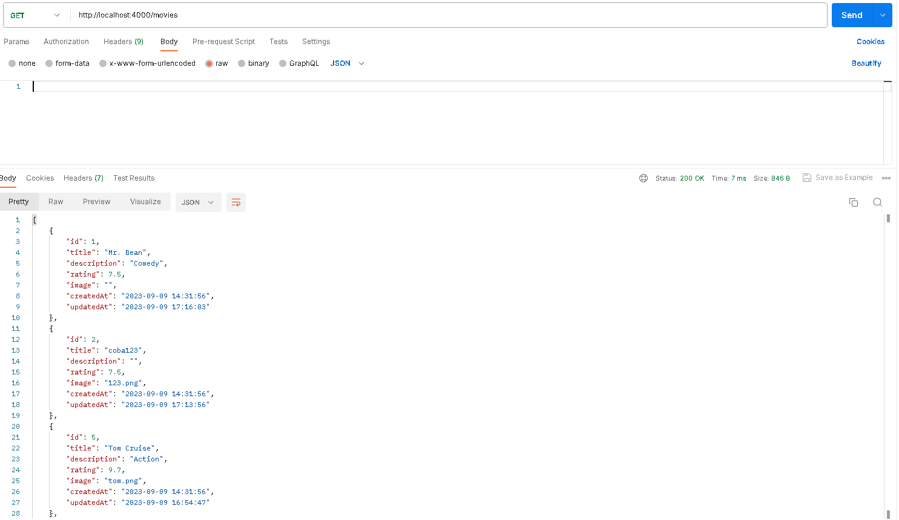
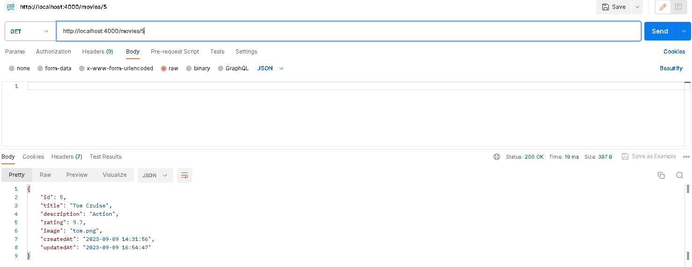
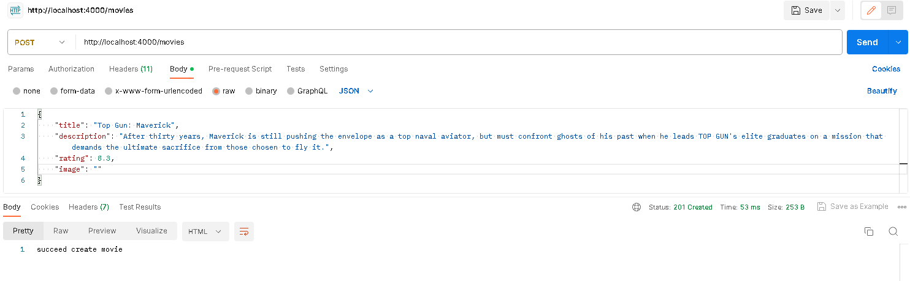
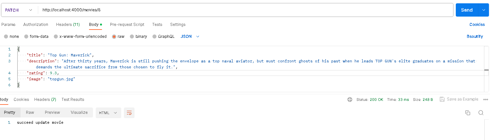
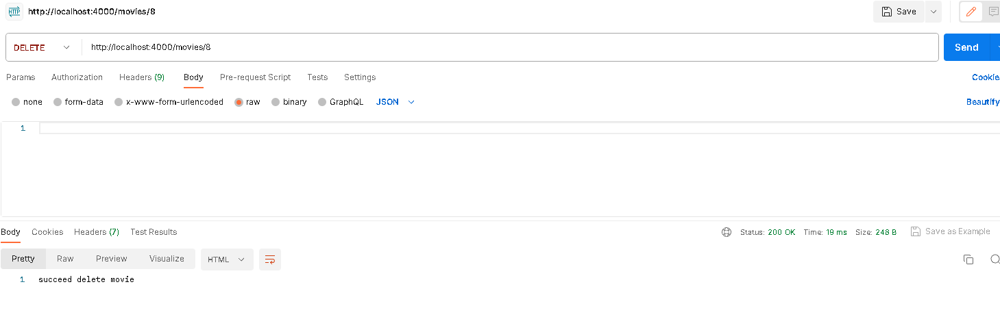

<h1 align="center">
    Xsis Developer Test
</h1>

## Getting Started/Installation

1. First, clone or download this repo
```bash

```
2. Second, Create mysql database from your machine, then run sql script below :

```bash
CREATE TABLE `movie` (
  `id` int NOT NULL AUTO_INCREMENT,
  `title` varchar(300) NOT NULL,
  `description` varchar(300) NOT NULL,
  `rating` float NOT NULL,
  `image` varchar(300) NOT NULL,
  `created_at` datetime NOT NULL,
  `updated_at` varchar(100) NOT NULL,
  PRIMARY KEY (`id`)
) ENGINE=InnoDB AUTO_INCREMENT=8 DEFAULT CHARSET=utf8mb4 COLLATE=utf8mb4_0900_ai_ci
```

3. Third, To Setup Database : <br>
Edit/Change **default.yaml** and **development.yaml** file on **config** folder according to your database configuration

4. Fourth, Open terminal then run/enter below : 

```bash
npm install
npm start
```
<br>

# Endpoint Demo :

<h3>1. List Of Movie</h3>



<h3>2. Detail Of Movie</h3>



<h3>3. Add New Movie</h3>



<h3>4. Update Movie</h3>



<h3>5. Delete Movie</h3>




## Note :
This restfull api build with nodejs and require npm to run it<br>
So If you haven't installed Node JS yet, you can install it here :
https://nodejs.org/en/download